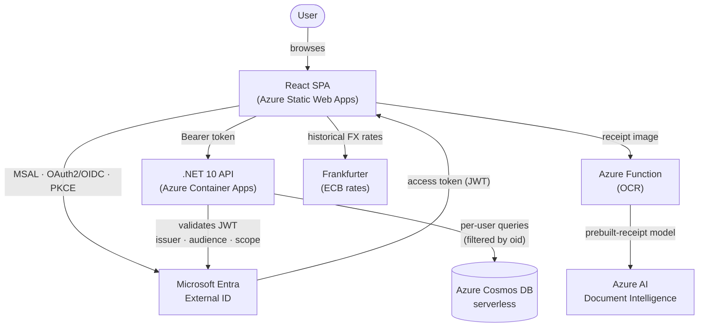
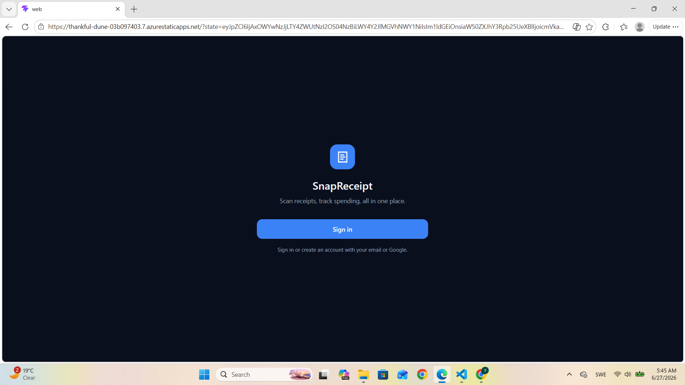
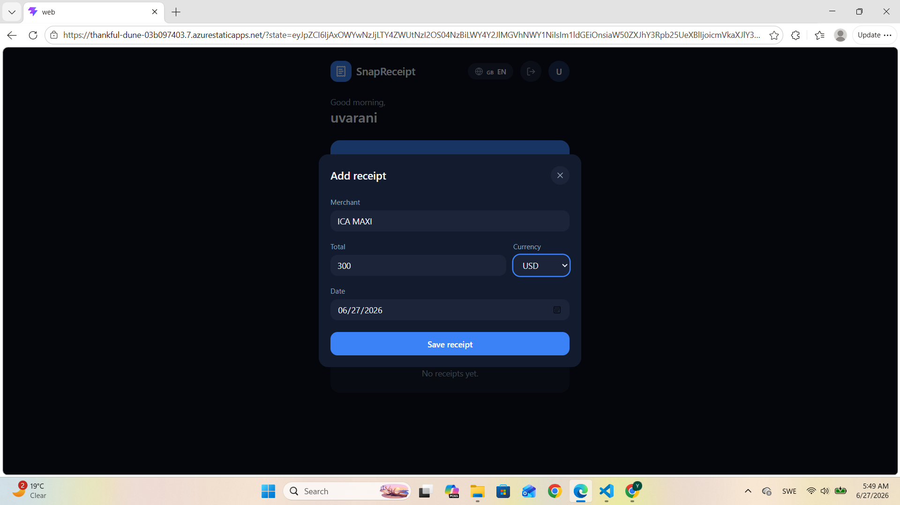
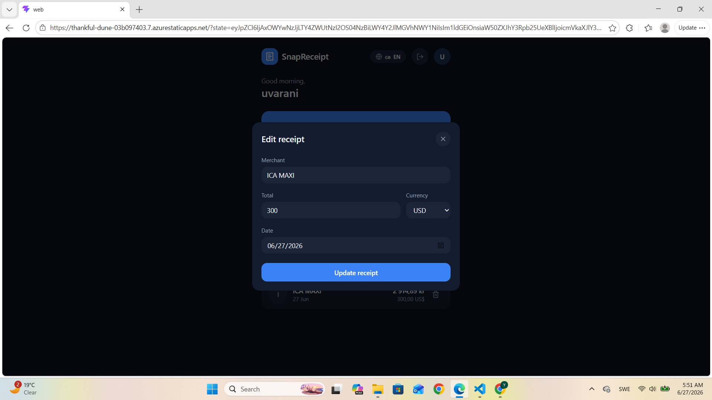
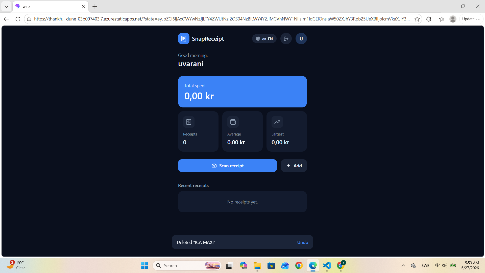
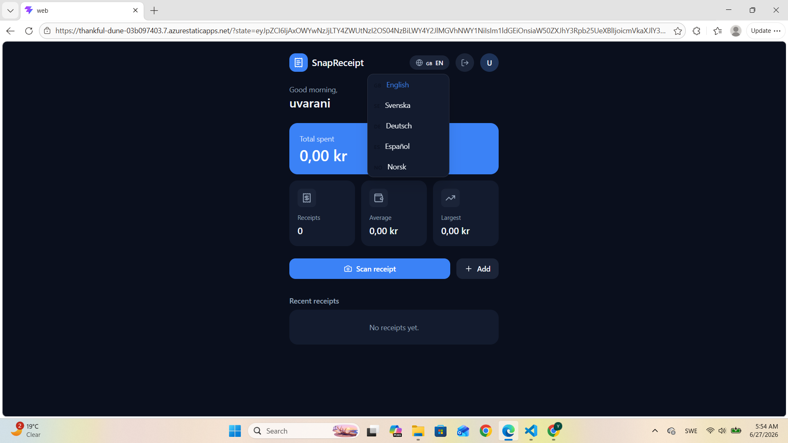

# 🧾 SnapReceipt

**A cloud-native receipt & expense tracker — scan a receipt, auto-extract the details with AI, normalize foreign currencies, and track spending. Built end-to-end with .NET 10, React, and Azure.**

<p align="center">
  <a href="https://thankful-dune-03b097403.7.azurestaticapps.net"><b>🔗 Live Demo</b></a>
  &nbsp;•&nbsp;
  <a href="#-architecture">Architecture</a>
  &nbsp;•&nbsp;
  <a href="#-key-features">Features</a>
  &nbsp;•&nbsp;
  <a href="#-engineering-highlights">Engineering Highlights</a>
  &nbsp;•&nbsp;
  <a href="#-running-it-locally">Run Locally</a>
</p>

<p align="center">
  
  
  
  
  
</p>

> **Live:** https://thankful-dune-03b097403.7.azurestaticapps.net
> Sign up with any email to try it — your data is private to your account.


## ✨ What it is

SnapReceipt is a full-stack web app that turns the chore of expense tracking into a few taps. You photograph a receipt, **Azure AI extracts the merchant, total, and date automatically**, foreign-currency amounts are **converted to a home currency using the exchange rate on the receipt's date**, and everything is tracked on a clean, multilingual dashboard — behind **real consumer authentication** where each user only ever sees their own data.

It's deliberately built the way a production app would be: a secured API, per-user data isolation, serverless components, and automated cloud deployment.

---

## 🎯 Why this project is worth a look

This isn't a to-do tutorial. It demonstrates the full lifecycle a mid-level full-stack engineer is expected to own:

| Capability | What it shows |
|---|---|
| 🔐 **Consumer authentication** | Microsoft Entra External ID (CIAM), OAuth 2.0 / OpenID Connect, Authorization Code + PKCE, MSAL, JWT validation |
| 🗂️ **Per-user data isolation** | The API derives the owner from the *validated token* and scopes every read/write — users can't see or touch each other's data |
| 🤖 **AI document processing** | Azure AI Document Intelligence reads real receipts (merchant, total, date) from a photo |
| ☁️ **Cloud-native on Azure** | Container Apps, Cosmos DB (serverless), Static Web Apps, Functions, all deployed via CI/CD |
| 🌍 **Internationalization** | Full i18n in 5 languages + multi-currency normalization using live ECB rates |
| 🚀 **DevOps** | GitHub Actions pipelines deploying both the API and the frontend automatically |

---

## 🛠️ Tech Stack

**Frontend**
React 19 · TypeScript · Vite · Tailwind CSS · TanStack Query · MSAL React · react-i18next

**Backend**
.NET 10 (minimal API) · C# · Microsoft.Identity.Web · Azure Cosmos DB SDK

**Azure**
Entra External ID · Container Apps · Cosmos DB (serverless) · Static Web Apps · Functions (Flex Consumption) · AI Document Intelligence

**DevOps**
GitHub Actions (CI/CD) · OpenID Connect federated deployment

---

## 🏗️ Architecture



**Request flow in one sentence:** the React SPA signs the user in through Entra External ID, receives a JWT access token, and sends it as a Bearer token to the .NET API, which validates the token and returns only the receipts owned by that user.

---

## 📸 Screenshots
### 🔐 Sign in


### 📊 Dashboard


### ➕ Add a receipt


### ✏️ Edit a receipt


### 🗑️ Delete with undo


### 🌍 Multiple languages


## 🔑 Key Features

- **Sign in with email** — public sign-up/sign-in via Microsoft Entra External ID (consumer identity).
- **Scan a receipt** — snap a photo; Azure AI Document Intelligence extracts merchant, total, and date and pre-fills the form for review.
- **Multi-currency, normalized** — foreign receipts are converted to SEK using the European Central Bank rate **for the receipt's date**, so historical totals stay accurate.
- **Per-user privacy** — every receipt is owned by the user who created it; the dashboard, totals, and edits are scoped to that user.
- **Full CRUD with polish** — add/edit/delete with optimistic UI updates and an undo window on delete.
- **5 languages** — English, Swedish, German, Spanish, Norwegian (react-i18next), with the choice persisted.
- **Spending overview** — total spent, receipt count, average, and largest, all in your home currency.

---

## 🧠 Engineering Highlights

### Authentication & security
- **Microsoft Entra External ID** (CIAM / customer identity) with a dedicated external tenant.
- **OAuth 2.0 + OpenID Connect**, **Authorization Code flow with PKCE** — the SPA is a **public client with no client secret** (the secure modern pattern).
- **MSAL React** acquires tokens silently and attaches them to every API call.
- The **.NET API validates each JWT** (signature, issuer, audience, lifetime, and the `access_as_user` scope) using **Microsoft.Identity.Web**; unauthenticated requests get a clean `401`.
- **No secrets in source control** — identity uses public client/tenant identifiers only; data-store credentials are supplied through environment configuration, never committed.

### Per-user data isolation
- The API reads the caller's **object id (`oid`) from the validated token**, not from the request body — so ownership can't be spoofed.
- Reads are filtered by owner; updates and deletes verify ownership first and return `404` for anything that isn't yours (no information leak).

### Cloud-native Azure
- **.NET 10 minimal API** on **Azure Container Apps**.
- **Azure Cosmos DB (serverless)** for receipts.
- **Azure Functions (Flex Consumption)** running the OCR endpoint against **Azure AI Document Intelligence** (`prebuilt-receipt`).
- **Azure Static Web Apps** hosts the React frontend.

### DevOps / CI-CD
- **GitHub Actions** pipelines deploy the API and the frontend automatically on merge to `main`.
- API deployment authenticates to Azure with **OpenID Connect federated credentials** (no stored cloud secrets).
- Feature-branch workflow: one feature → one branch → reviewed PR → squash-merge.

---

## 💻 Running it locally

This repo contains **no secrets** — you bring your own Azure resources. You'll need an Azure subscription, an Entra External ID tenant + app registration, a Cosmos DB account, and (for OCR) an Azure AI Document Intelligence resource.

### Prerequisites
- [.NET 10 SDK](https://dotnet.microsoft.com/)
- [Node.js 20+](https://nodejs.org/)
- An Azure subscription

### 1. Backend (API)
```bash
cd src/Api/SnapReceipt.Api
```
Provide configuration (via user-secrets or environment variables — **do not commit these**):
```jsonc
// Cosmos connection string (from your Cosmos account)
"Cosmos:ConnectionString": "AccountEndpoint=...;AccountKey=...;"

// Entra External ID app registration (your tenant)
"AzureAd:Instance": "https://<your-subdomain>.ciamlogin.com/",
"AzureAd:TenantId": "<your-tenant-id>",
"AzureAd:ClientId": "<your-client-id>"
```
```bash
dotnet run
```

### 2. Frontend (web)
```bash
cd src/web
npm install
```
Create `src/web/.env.development`:
```
VITE_API_BASE_URL=http://localhost:5035
```
Set your tenant/app values in `src/web/src/authConfig.ts` (client id, tenant id, subdomain), then:
```bash
npm run dev
```

> Each user who signs in gets their own private set of receipts — a brand-new account starts with an empty dashboard.

---

## 🗺️ Roadmap

Planned next steps (each its own branch/PR):

- 🖼️ **Receipt image storage** — store the scanned image in **Azure Blob Storage** (private container) and view it via a short-lived **user-delegation SAS** (no account keys).
- 🔵 **Google sign-in** — add Google as a federated identity provider (one-tap social login).
- 👤 **Role-based access control (RBAC)** — an admin role enforced via Entra app roles.
- 📄 **Receipt detail page** — full-screen view of a receipt with its image and breakdown.

---

## 👤 Contact


**[Uvarani Pandian]** — Full-Stack Developer (.NET · React · Azure)
[LinkedIn](https://www.linkedin.com/in/uvarani-pandian-b4269565/) · [Email](pyuvarani.2011@gmail.com)


<p align="center"><i>Built as a portfolio project to demonstrate production-style full-stack engineering on Azure.</i></p>

